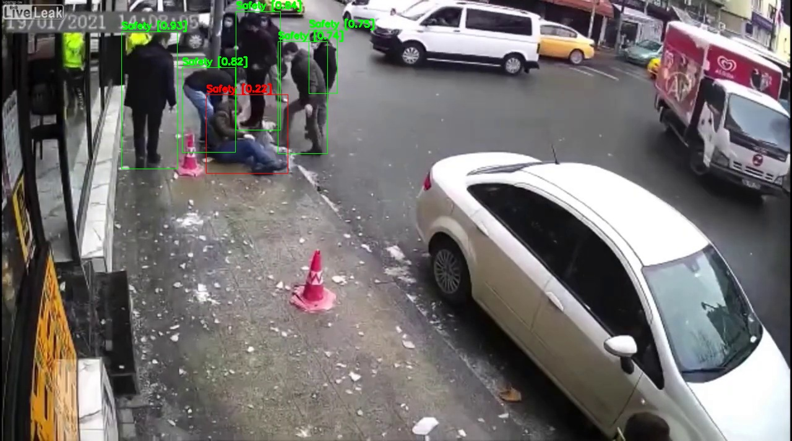

# Object Monitoring Example

## How to build the docker image

docker build . -t object_monitoring

## How to run the docker image 

docker run -p 9000:9000 --rm object_monitoring

## How to submit a post request

**Structured data response**

1. Test request

    ```
    curl -F 'binData=@test_image.jpg' localhost:9000/api/v1.0/predictions
    ```

1. Test response

    ```
    {"jsonData":{"result":[[[196.64071655273438,51.72584533691406,286.6526184082031,273.0321044921875,0.842630922794342,0.0],"An image showing a person standing on the ground: 0.8516269326210022","An image showing a person is safe: 0.08110714703798294","An image showing a person falling on the ground: 0.01137877069413662","An image showing a person is not safe: 0.04858367145061493","An image showing a person meets with an accident: 0.007303500548005104"],[[449.29620361328125,67.60279846191406,529.5941162109375,248.775634765625,0.7911722660064697,0.0],"An image showing a person standing on the ground: 0.6139260530471802","An image showing a person is safe: 0.12558218836784363","An image showing a person falling on the ground: 0.12772634625434875","An image showing a person is not safe: 0.09781526029109955","An image showing a person meets with an accident: 0.03495015576481819"],[[381.26171875,18.864341735839844,453.32769775390625,210.52777099609375,0.7209171652793884,0.0],"An image showing a person standing on the ground: 0.1380673050880432","An image showing a person is safe: 0.3793591856956482","An image showing a person falling on the ground: 0.04241769015789032","An image showing a person is not safe: 0.39846232533454895","An image showing a person meets with an accident: 0.04169353097677231"],[[499.121337890625,48.2452392578125,545.7568359375,151.6309814453125,0.6876177191734314,0.0],"An image showing a person standing on the ground: 0.5593545436859131","An image showing a person is safe: 0.17079567909240723","An image showing a person falling on the ground: 0.06316084414720535","An image showing a person is not safe: 0.17174695432186127","An image showing a person meets with an accident: 0.03494199365377426"],[[333.56390380859375,153.64605712890625,465.16094970703125,280.6673889160156,0.646729052066803,0.0],"An image showing a person standing on the ground: 0.018119359388947487","An image showing a person is safe: 0.2384641468524933","An image showing a person falling on the ground: 0.2607134282588959","An image showing a person is not safe: 0.28449928760528564","An image showing a person meets with an accident: 0.19820380210876465"],[[294.857666015625,109.74063110351562,380.731689453125,246.7911376953125,0.6339437961578369,0.0],"An image showing a person standing on the ground: 0.2823730707168579","An image showing a person is safe: 0.22179362177848816","An image showing a person falling on the ground: 0.2755547761917114","An image showing a person is not safe: 0.16993996500968933","An image showing a person meets with an accident: 0.050338517874479294"]]},"meta":{"metrics":[{"key":"object_monitor_warning","type":"GAUGE","value":1}]}}
    ```

**Encoded image response**

1. Change `ENV RETURN_IMAGE` from `'0'` to `'1'` in the Dockerfile and rebuild the image
1. Send by curl

    ```
    curl -F 'binData=@test_image.jpg' localhost:9000/api/v1.0/predictions | jq -r .binData | base64 --decode > output.jpg
    ```

1. The result goes to output.jpg

    

## Reference
- `test_image.jpg`: https://www.youtube.com/watch?v=BzecMZUZ_3Y
